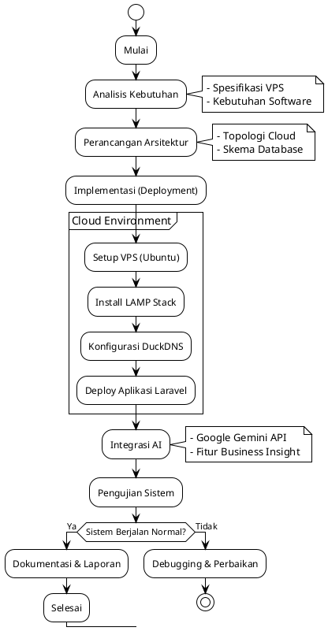
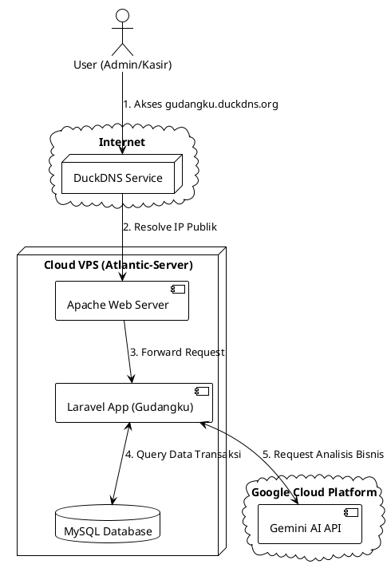
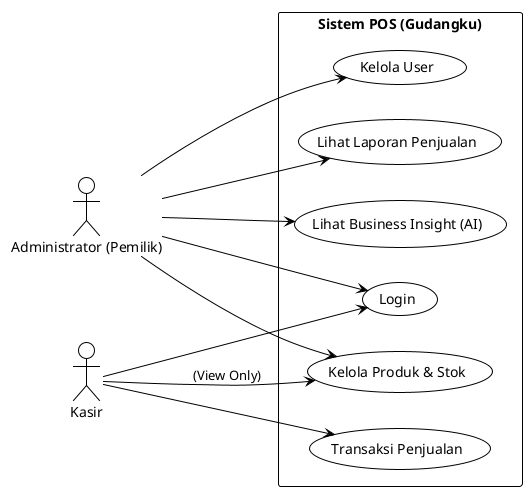
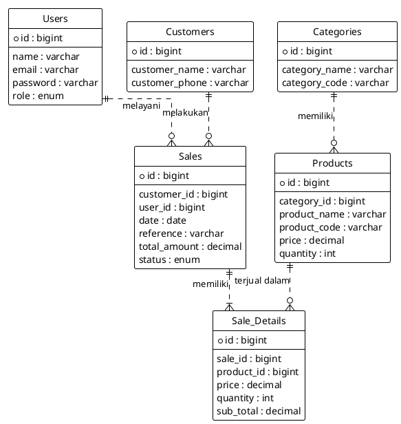
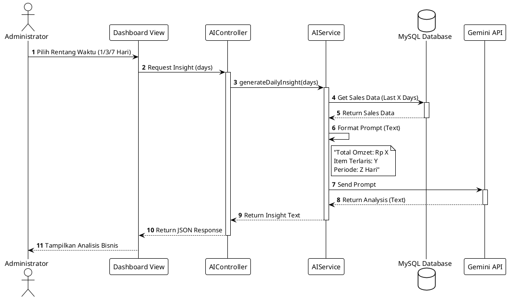

# PlantUML Diagrams for Final Report

Berikut adalah kode PlantUML untuk men-generate gambar-gambar yang dibutuhkan di Bab 3. Anda bisa copy-paste kode ini ke [PlantText](https://www.planttext.com/) atau editor PlantUML lainnya untuk mendapatkan gambarnya.

## 1. Diagram Alur Penelitian (Flowchart)
*Gambar 3.1*

## 2. Topologi Arsitektur Cloud
*Gambar 3.2*

## 3. Use Case Diagram
*Gambar 3.3*

## 4. Entity Relationship Diagram (ERD)
*Gambar 3.4*

## 5. Sequence Diagram Integrasi AI
*Gambar 3.5*

